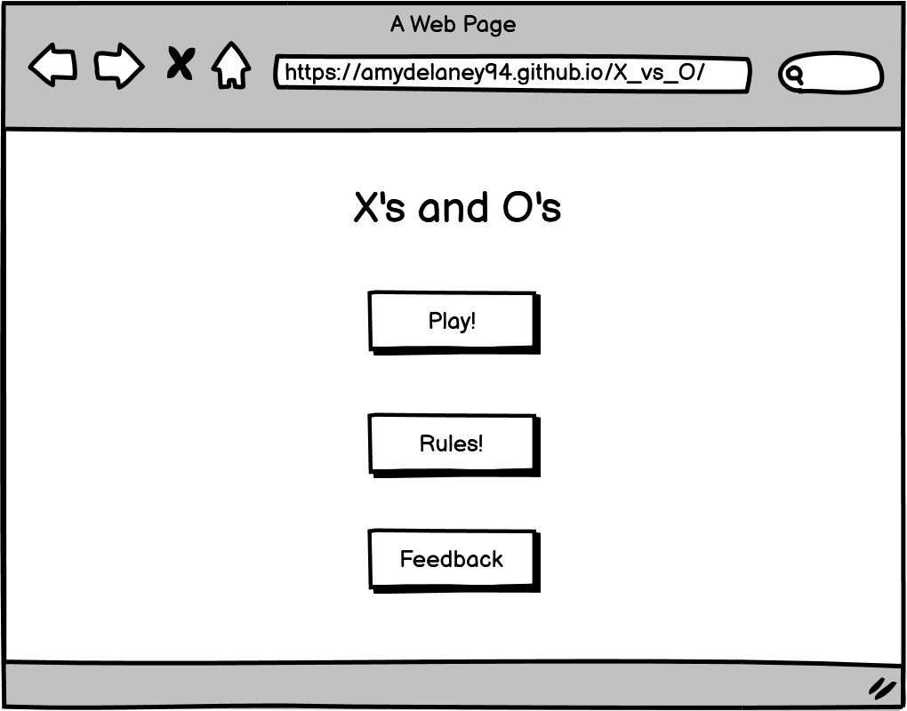

<!-- TOC -->
# X's vs O's

X's and O's is a 3*3 two player game. This website has been created to allow a player to play against the computer. The website is easy to navigate through buttons that lead to a game area, rules section, and feedback form.

The deployed website can be found <a href="https://amydelaney94.github.io/X_vs_O/" >here</a>.

<!-- TOC -->
## Table of Contents

<!-- TOC start -->
  * [User Experience](#user-experience)
    + [Project Goals](#project-goals)
    + [User Stories](#user-stories)
    + [Colour Scheme](#colour-scheme)
    + [Typography](#typography)
    + [Wireframes](#wireframes)
  * [Features](#features)
    + [General ](#general)
      - [Header](#header)
    + [Home Page](#home-page)
    + [Game Area](#game-area)
        * [Player Choice](#player-choice)
        * [Score](#score)
        * [Reset Button](#reset-button)
    + [Rules ](#rules)
    + [Feedback Form](#feedback-form)
  * [Technology Used ](#technology-used)
    + [Languages Used](#languages-used)
    + [Other Technologies Used](#other-technologies-used)
  * [Testing](#testing)
  * [References: ](#references)
      - [Code](#code)
    + [Acknowledgements](#acknowledgements)
<!-- TOC end -->

<!-- TOC -->
## User Experience
<!-- TOC -->
### Project Goals
- The website is easy to navigate and user friendly. 
- The website is interactive for the user and is responsive on mutiple devices ranging from mobile to desktop.
- The website doesn't have a conflicting colour scheme making it easy to view.
- To provide a feedback section for users to submit any comments to assist with the sites future development.
- To provide the user with an easy to find rule section to explain how the game works.

<!-- TOC -->
### User Stories
- As a player, I want the website to be easy to navigate between pages.
- As a player, I want the rules to be easily accessable. 
- As a player, I want the game to be user friendly.
- As a player, I want the game to work on multiple devices.
- As a player, I want the game to be fun and engaging. 

<!-- TOC -->
### Colour Scheme

The colours used in this project compliment eachother and were chosen using the website <a href="https://coolors.co/">Coolors</a>. The sites background is a blue linear gradient from #00D2FF to #3A47D5. The game heading and main buttons are a coral colour of #FF7F50, this colour is also used in the border of the forms text boxes. The container for the rules pop-up and heading of the form are a yellow, #FFD166. The close button of the rules pop-up is a pale lilac, #E6ADEC. The text used in buttons and form is a grey, #3C3C3C.    

<!-- TOC -->
### Typography
The main font used in the body of this site is EB Garamond with a back up font of serif it fails to load or be imported correctly. The font used for headings is Cairo with a backup of Sans Serif. 

<!-- TOC -->
### Wireframes
<a href="https://balsamiq.com/">Balsamiq</a> was used to design the wireframes used to design the layout of the website and the location of the sites elements and functions.  

<!-- TOC -->
## Features
<!-- TOC -->
### General 
- The website was designed mobile first. 
- The website is responsive across all devices. 

<!-- TOC -->
#### Header

<!-- TOC -->
### Home Page

<!-- TOC -->
### Game Area
<!-- TOC -->
##### Player Choice
<!-- TOC -->
##### Score
<!-- TOC -->
##### Reset Button

<!-- TOC -->
### Rules 

<!-- TOC -->
### Feedback Form

<!-- TOC -->
## Technology Used 
<!-- TOC -->
### Languages Used
- <a href="https://en.wikipedia.org/wiki/HTML5">HTML5</a>
- <a href="https://en.wikipedia.org/wiki/CSS">CSS3</a>
- <a href="https://en.wikipedia.org/wiki/JavaScript">JavaScript</a>

<!-- TOC -->
### Other Technologies Used
- <a href="https://fonts.google.com/">Google Fonts</a> 
    - Google Fonts was used to import the fonts of EB Garamond and Cairo to the style.css file. These fonts were used throughout the website. 
- <a href="https://fontawesome.com/v5.15">Font Awesome</a>
    - Font Awesome was used to add icons in order to create a better visual experience for UX purposes. 
- <a href="https://gitpod.io/">GitPod</a> 
    - GitPod was used for writing code, committing, and then pushing to GitHub.
- <a href="https://github.com/">GitHub</a>
    - GitHub was used to store the project after pushing.
- <a href="https://balsamiq.com/">Balsamiq</a>
    - Balsamiq was used to create the mobile and desktop wireframes during the design phase of the project.
- <a href="http://ami.responsivedesign.is/">Am I Responsive?</a>
    - Am I Responsive was used in order to see responsive design throughout the process.
- <a href="https://responsivedesignchecker.com/">Responsive Design Checker</a>
    - Responsive Design Checker was used in the testing process to check responsiveness on various devices.
- <a href="https://developer.chrome.com/docs/devtools/">Chrome DevTools</a>
    - Chrome DevTools was used during development process for code review and to test responsiveness.
- <a href="https://validator.w3.org/">W3C MarkUp Validator</a>
    - W3C Markup Validator was used to validate the HTML code.
- <a href="https://jigsaw.w3.org/css-validator/">W3C CSS Validator</a>
    - W3C CSS Validator was used to validate the CSS code.
- <a href="https://jshint.com/">JSHint</a>
    - The JSHints JavaScript Code Quality Tool was used to validate the site's JavaScript code.

<!-- TOC -->
## Testing

### User Testing

### Manual Testing 
* Browser Compatability

Browser | Outcome | Pass/Fail  
---|---|---
Google Chrome | No appearance, responsiveness nor functionality issues.| Pass
Safari | No appearance, responsiveness nor functionality issues. | Pass
Mozilla Firefox | No responsiveness nor functionality issues.| Pass
Microsoft Edge | No appearance, responsiveness nor functionality issues. | Pass

* Device compatibility

Device | Outcome | Pass/Fail
--- | --- | ---
Laptop| No appearance, responsiveness nor functionality issues. | Pass
Mac | No appearance, responsiveness nor functionality issues. | Pass
iPad | No appearance, responsiveness nor functionality issues. | Pass
iPad | No appearance, responsiveness nor functionality issues. | Pass
iPhone XR | No appearance, responsiveness nor functionality issues. | Pass
iPhone SE| No appearance, responsiveness nor functionality issues. | Pass

<!-- TOC -->
## References: 

<!-- TOC -->
#### Code
- https://animate.style/ 
    - used for css style on H1 element 

- https://www.w3schools.com/default.asp
    - used for help with css, JS and HTML

<!-- TOC -->
### Acknowledgements
    

    