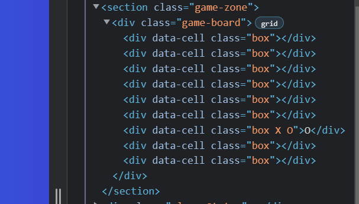
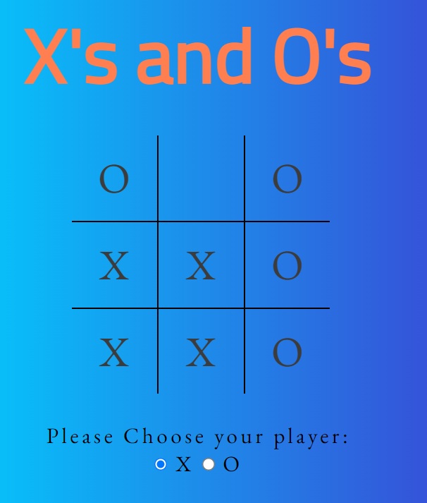

<!-- TOC -->
# X's vs O's

X's and O's is a 3*3 two player game. This website has been created to allow a player to play against the computer. The website is easy to navigate through buttons that lead to a game area, rules section, and feedback form.

The deployed website can be found <a href="https://amydelaney94.github.io/X_vs_O/" >here</a>.

<!-- TOC -->
## Table of Contents

<!-- TOC start -->
  * [User Experience](#user-experience)
    + [Project Goals](#project-goals)
    + [User Stories](#user-stories)
    + [Colour Scheme](#colour-scheme)
    + [Typography](#typography)
    + [Wireframes](#wireframes)
  * [Features](#features)
    + [General ](#general)
      - [Header](#header)
    + [Page Features](#page-features)
  * [Technology Used ](#technology-used)
    + [Languages Used](#languages-used)
    + [Other Technologies Used](#other-technologies-used)
  * [Testing](#testing)
  * [Bugs](#bugs)
  * [Deployment] (#deployment)
  * [References: ](#references)
      - [Code](#code)
    + [Acknowledgements](#acknowledgements)
<!-- TOC end -->

***

<!-- TOC -->
## User Experience
<!-- TOC -->
### Project Goals
- The website is easy to navigate and user friendly. 
- The website is interactive for the user and is responsive on mutiple devices ranging from mobile to desktop.
- The website doesn't have a conflicting colour scheme making it easy to view.
- To provide a feedback section for users to submit any comments to assist with the sites future development.
- To provide the user with an easy to find rule section to explain how the game works.

<!-- TOC -->
### User Stories
- As a player, I want the website to be easy to navigate between pages.
- As a player, I want the rules to be easily accessable. 
- As a player, I want the game to be user friendly.
- As a player, I want the game to work on multiple devices.
- As a player, I want the game to be fun and engaging. 

<!-- TOC -->
### Colour Scheme

The colours used in this project compliment eachother and were chosen using the website <a href="https://coolors.co/">Coolors</a>. The sites background is a blue linear gradient from #00D2FF to #3A47D5 which was sourced from <a href="https://cssgradient.io/blog/linear-gradient-css/">CSS Gradient</a>. The game heading and main buttons are a coral colour of #FF7F50, this colour is also used in the border of the forms text boxes. The container for the rules pop-up and heading of the form are a yellow, #FFD166. The close button of the rules pop-up is a pale lilac, #E6ADEC. The text used in buttons and form is a grey, #3C3C3C.    

<!-- TOC -->
### Typography
The main font used in the body of this site is EB Garamond with a back up font of serif it fails to load or be imported correctly. The font used for headings is Cairo with a backup of Sans Serif. 

<!-- TOC -->
### Wireframes
<a href="https://balsamiq.com/">Balsamiq</a> was used to design the wireframes used to design the layout of the website and the location of the sites elements and functions.

Page View | Wireframe
---|---
Desktop View | 
Mobile View   Game Area |
Mobile View   Home and Feedback Pages |

<!-- TOC -->
## Features
<!-- TOC -->
### General 
- The website was designed mobile first. 
- The website has been designed to be responsive across all devices. 

<!-- TOC -->
#### Header
- The heading contaings the site name and is present on every game page.

<!-- TOC -->
###  Page Features

Feature | Image | Notes   
---|---|---
Home Page |  | - Overview of homepage.
Main Buttons |  | - The buttons on the home page direct the player to the game area, a rules pop-up, or a feedback form page.  - The Play button brings players to the Game Page.   - The Rules button activates a pop-up showing the rules and site controls.   - The Feedback button brings players to an accessible form to be able to submit their feedback.
Rules Pop-up |  | - The Rules pop-up explains the rules of the game to the player and has a visible close button. Alternatively the players can choose the play button directly to go from Rules to Game Play. 
Game Area |  | - Game Area is comprised of a 3*3 grid and includes a player choice button and reset button. 
Player Choice |  | - Allows the player to chose X or O.
Score Counter |  | - Counts number of games Won against the computer.
Reset Button |  | - Allows user to reset the game. 
Feedback Form |  | - The feedback form was added to allow users to submit feedback on the site.
Form submission button |  | - Used to submit feedback  
Blank Entry Promt |  | - The form also promts users to fill in any blanks before submission.

<!-- TOC -->
## Technology Used 
<!-- TOC -->
### Languages Used
- <a href="https://en.wikipedia.org/wiki/HTML5">HTML5</a>
- <a href="https://en.wikipedia.org/wiki/CSS">CSS3</a>
- <a href="https://en.wikipedia.org/wiki/JavaScript">JavaScript</a>

<!-- TOC -->
### Other Technologies Used
- <a href="https://fonts.google.com/">Google Fonts</a> 
    - Google Fonts was used to import the fonts of EB Garamond and Cairo to the style.css file. These fonts were used throughout the website. 
- <a href="https://fontawesome.com/v5.15">Font Awesome</a>
    - Font Awesome was used to add icons in order to create a better visual experience for UX purposes. 
- <a href="https://gitpod.io/">GitPod</a> 
    - GitPod was used for writing code, committing, and then pushing to GitHub.
- <a href="https://github.com/">GitHub</a>
    - GitHub was used to store the project after pushing.
- <a href="https://balsamiq.com/">Balsamiq</a>
    - Balsamiq was used to create the mobile and desktop wireframes during the design phase of the project.
- <a href="http://ami.responsivedesign.is/">Am I Responsive?</a>
    - Am I Responsive was used in order to see responsive design throughout the process.
- <a href="https://responsivedesignchecker.com/">Responsive Design Checker</a>
    - Responsive Design Checker was used in the testing process to check responsiveness on various devices.
- <a href="https://developer.chrome.com/docs/devtools/">Chrome DevTools</a>
    - Chrome DevTools was used during development process for code review and to test responsiveness.
- <a href="https://validator.w3.org/">W3C MarkUp Validator</a>
    - W3C Markup Validator was used to validate the HTML code.
- <a href="https://jigsaw.w3.org/css-validator/">W3C CSS Validator</a>
    - W3C CSS Validator was used to validate the CSS code.
- <a href="https://jshint.com/">JSHint</a>
    - The JSHints JavaScript Code Quality Tool was used to validate the site's JavaScript code.

<!-- TOC -->
## Testing

### User Stories Testing
- As a player, I want the website to be easy to navigate between pages.
    - The buttons on the site allow easy navigation across the site. 
    - The heading is also a link back to all the home page.
- As a player, I want the rules to be easily accessable. 
    - This has been achieved through a Pop-up button on the home screen.
- As a player, I want the game to be user friendly.
    - The games design was kept simple and and easy to use with basic controls.
- As a player, I want the game to work on multiple devices.
    - The Game is responsive on multiple screen sizes. 
- As a player, I want the game to be fun and engaging.
    - The sites clours have been chosen to compliment each other.
    - The colours stay consistent throughout the sites pages. 
    - The score is displayed below the playing area. 

### Manual Testing 
* Browser Compatability

Browser | Outcome | Pass/Fail  
---|---|---
Google Chrome | No appearance, responsiveness nor functionality issues.| Pass
Safari | No appearance, responsiveness nor functionality issues. | Pass
Mozilla Firefox | No responsiveness nor functionality issues.| Pass
Microsoft Edge | No appearance, responsiveness nor functionality issues. | Pass

* Device compatibility (responsiveness)

Device | Outcome | Pass/Fail
--- | --- | ---
Laptop| No appearance, responsiveness nor functionality issues. | Pass
Mac | No appearance, responsiveness nor functionality issues. | Pass
iPad | No appearance, responsiveness nor functionality issues. | Pass
iPad | No appearance, responsiveness nor functionality issues. | Pass
iPhone XR | No appearance, responsiveness nor functionality issues. | Pass
iPhone SE| No appearance, responsiveness nor functionality issues. | Pass

### Code Validation

- <a href="https://jigsaw.w3.org/css-validator">W3C CSS Validator</a> found no errors or warnings on my CSS.

- There were no errors found when passing code through the <a href="https://validator.w3.org/nu/">Html Validator</a> on any of the pages.

Code | Page | Score  
--- | --- | --- 
CSS | Site Wide | 
HTML | Home Page |  
HTML | Feedback Form|  
HTML | Game Page | 
JavaScript| Site Wide | **ADD IMAGE HERE** 

### Lighthouse Reports
Report | Score | Summary  
--- | --- | ---
Report |  | - Used <a href="https://web.dev/measure/?gclid=Cj0KCQiAweaNBhDEARIsAJ5hwbczVsoK10OpLKs4epRzetRRAXVlkYT5yVfwU0CNb6FB4UNvojxrk_saAjzqEALw_wcB">Lighthouse</a> to confirm that the colors and fonts being used in throughout the website are easy to read and accessible.   - Was also used to test that the page loads correctly without delay to ensure a positive user experience.

### Common Elements Testing 
- General

Feature | Outcome | Pass/Fail
--- | --- | ---
Heading | CSS styles work as expected on each page | Pass
Buttons | Operate as expected | Pass

- Home Page

Feature | Outcome | Pass/Fail
--- | --- | ---
Play Button | Navigates to Game Screen | Pass
Rules Button | Activates Rules Pop-Up Function | Pass
Rules Close Button | Closes Pop-Up as expected | Pass
Feedback Button | Navigates to Feedback Section as expected | Pass

- Game Page

Feature | Outcome | Pass/Fail
--- | --- | ---
Player Choice | Allows player to chose X or O | Pass
Computer | Playes against the user as Player 2 | Pass
Reset Button | Clears Game Board and Player Choice when selected | Pass
    
- Feedback Form Page

Feature | Outcome | Pass/Fail
--- | --- | ---
Form | Require all fields in the right format before submission | Pass
Send Feedback Button | Submits form when cicked | Pass

- Error 404 Page

Feature | Outcome | Pass/Fail
--- | --- | ---
404 Error Page | Entering an incorrect address brings the player to the 404 error page | Pass
Back to Game Button | Brings user to Home Page when clicked | Pass

<!-- TOC -->
## Bugs: 
### Fixed Bugs:
Bug | Image | Notes 
--- | --- | --- 
Prevented Computer Player from chosing the box chosen in the previous turn. |  | - This was achieved through the introduction of the function randomNumber().   - I added an alert during the testing phase to notify me when the Computer was attempting to selected an unavilable box.   - I researched this issue on stack overflow and fixed the issue with logic.   - When this bug was fixed it gave rise to my unfixed bug. 
Game Won Showing in Error. |  | - This bug was observed when the game was won by either the User or Computer.   - It caused the Score to increment in error.   - It was fixed by adding a new function for the scenario when the User loses the game.   - This function decrements the score by 1. 

### Unfixed Bugs: 
Bug | Image | Notes 
--- | --- | --- 
CPU overwriting previous choices made by the user | 

<!-- TOC -->
## Deployment: 
- This website was developed using <a href="https://gitpod.io/workspaces">GitPod</a>, which was then committed and pushed to GitHub using the GitPod terminal.

### GitHub Pages: 
- The following steps can be used to deploy the website to GitHub Pages from the GitHub Repository:
    - Log into GitHub and locate the <a href="https://github.com/AmyDelaney94/X_vs_O">GitHub Repository</a>.
    - At the top the page locate the Settings button on the menu.
    - Scroll down the Settings page until you locate the Pages Section. 
    - Under Source, click the dropdown and select Master Branch.
    - The page will refresh and generate the link to the website. The link will be active when the box surrounding the link turns from blue to green. 

<!-- TOC -->
## References: 

<!-- TOC -->
#### Code
- <a href="https://animate.style/">Animate.css</a> was used for css the style seen on the H1 element throughout the site. 

- <a href="https://www.w3schools.com/default.asp">W3Schools</a> was used as a resource for the creation of my css, JavaScript, and HTML.

- <a href="https://stackoverflow.com/">Stack Overflow</a> Used for assistance with troubleshooting issues. 

- <a href="https://css-tricks.com/almanac/properties/a/animation/">CSS-Tricks</a> used for assistance with improving site responsiveness. 

<!-- TOC -->
### Acknowledgements
- First I would like to thank my Partner for his love and support throughout the completion of this project. 
- I would also like to thank my mentor Marcel for his advice and support.
- My friends for constantly testing the project on their different devices. 
- Tutor Assistance for their help with fixing my GitPod following the global crash. 
- Code Institute and its Slack community for their support and providing me with the necessary knowledge to complete this project.

    